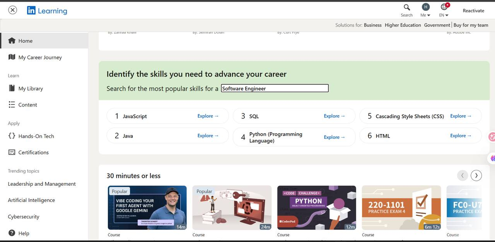
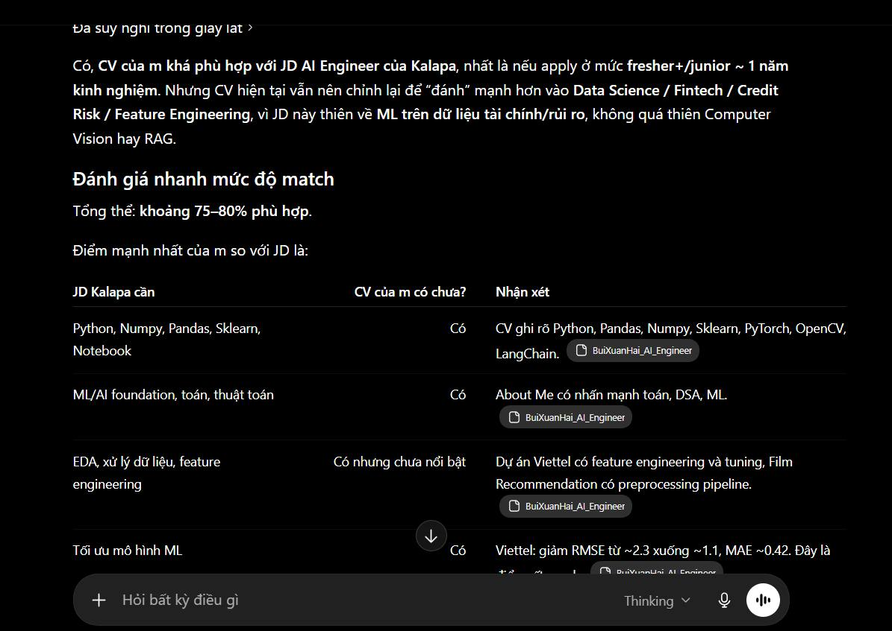
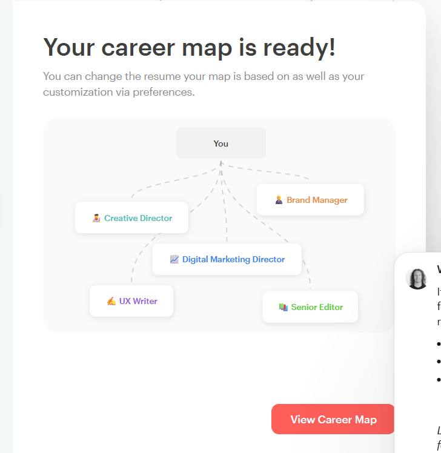
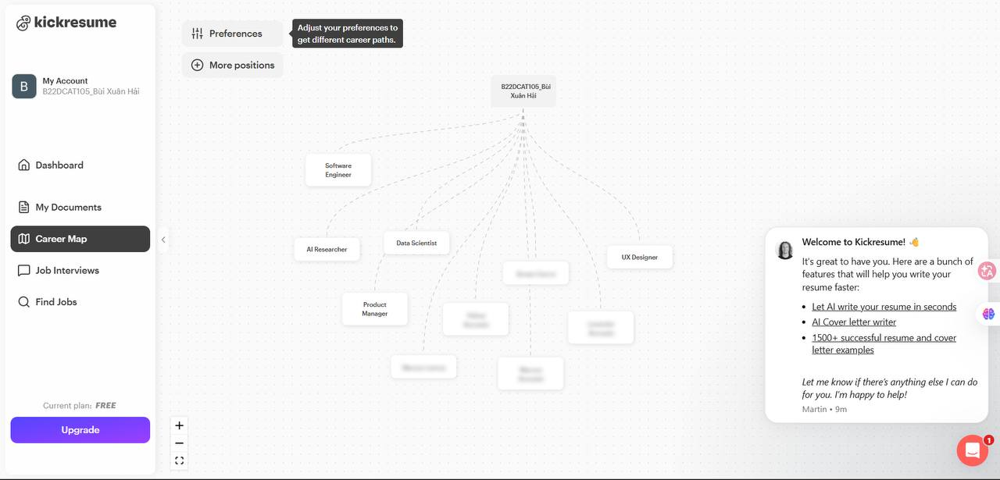

# Evidence Pack

## 1. Nhóm và track

**Mã học viên - Tên thành viên nhóm:**  
- 2A202600931 - Lê Sỹ Minh Quang
- 2A202600862 - Bùi Xuân Hải
- 2A202600698 - Nguyễn Quang Khánh An
- 2A202600676 - Đào Duy Quyền
- 2A202600616 - Nguyễn Như Yến Phương
---
**Track:**  Learning OS

**Product/app đã chọn:** Coursera (Career Academy) / LinkedIn Learning (Skill Paths) — dùng làm benchmark

**Build slice đang nghĩ:** AI nhận CV + JD → phân tích skill gap → tạo lộ trình học cá nhân hoá

### 2. Self-use evidence

| Observation | Screenshot/link | Path liên quan | Điều học được |
|---|---|---|---|
| LinkedIn Learning gợi ý khóa học dựa trên job title và skill phổ biến trong ngành, nhưng không phân tích skill thật sự user đang thiếu → gợi ý quá chung chung, không đào sâu vào các skill khó hơn mà user cần phát triển |  <br> [🔗 Xem ảnh gốc](./images/linkedin_learning.jpg) | Low-confidence | Recommendation dựa trên popularity và ngành nghề, không phải gap analysis — thiếu cơ chế so sánh skill hiện có vs skill target |
| Tự thử paste CV + JD vào ChatGPT để xin tư vấn → AI có thể phân tích gap, nhưng output dài, không structured, không có timeline, không track được tiến độ, và mỗi lần phải prompt lại từ đầu vì không có memory |  <br> [🔗 Ảnh 1](./images/chatgpt_1.jpg) <br>  <br> [🔗 Ảnh 2](./images/chatgpt_2.jpg) <br>  <br> [🔗 Ảnh 3](./images/chatgpt_3.jpg) <br>  <br> [🔗 Ảnh 4](./images/chatgpt_4.jpg) | Happy / Failure | AI có thể phân tích gap nhưng thiếu UX: không lưu context, không track progress, không gợi ý nguồn học cụ thể, mỗi session là độc lập |
| Thử Kickresume AI Career Map → cần điền đầy đủ thông tin cá nhân (kinh nghiệm, skill, mục tiêu) mới được gợi ý career path chuẩn; nếu chọn ít thông tin thì tư vấn mơ hồ, không ra lộ trình học chi tiết |  <br> [🔗 Ảnh 1](./images/kickresume_1.jpg) <br>  <br> [🔗 Ảnh 2](./images/kickresume_2.jpg) | Low-confidence | Có gap analysis nhưng phụ thuộc hoàn toàn vào data user tự nhập — thiếu phần actionable learning path với nguồn học và timeline cụ thể |

### 3. User / review / social evidence

| Quote / review / observation | Nguồn | User là ai? | Pain/failure mode |
|---|---|---|---|
| 85% người học Coursera đăng ký để phát triển kỹ năng cho sự nghiệp — nhưng **gần 2/3 không biết mình cần học skill gì** để đạt mục tiêu | Coursera Learner Outcomes Report, dẫn bởi Coursera Blog ["From Catalog to Compass"](https://blog.coursera.org/from-catalog-to-compass) (Apr 2025) | Người đi làm muốn upskill/chuyển ngành | Lộ trình cố định không tính đến kinh nghiệm và mục tiêu cụ thể của từng người |
| **40% người được khảo sát** cho biết rào cản lớn nhất khi phát triển kỹ năng chuyên môn là **không biết bắt đầu từ đâu** | IBM study, dẫn bởi [edX press release](https://press.edx.org/edx-launches-try-it-courses-in-high-demand-digital-and-tech-skills) | Self-learner, junior dev muốn upskill | Information overload, không biết chọn khóa nào |
| Dùng ChatGPT để phân tích CV + JD là pattern phổ biến, nhưng output chỉ là **một lần duy nhất** — không có hệ thống lưu lại hay theo dõi tiến độ | [Jobright.ai Blog — "ChatGPT Careers"](https://jobright.ai/blog/chatgpt-careers/) (2026) | Người tìm việc, mid-career | AI analysis tốt nhưng thiếu persistence và tracking |
| Tỷ lệ dropout của các MOOC từ Stanford, MIT, UC Berkeley dao động **80–95%**; chỉ 7% trong số 50.000 học viên hoàn thành khóa Software Engineering trên Coursera/UC Berkeley | ["MOOCs Completion Rates and Possible Methods to Improve Retention"](https://www.researchgate.net/publication/263348990_MOOCs_Completion_Rates_and_Possible_Methods_to_Improve_Retention_-_A_Literature_Review), ResearchGate (2014) | General online learners | Overwhelmed, không phù hợp level, thiếu personalization |

### 4. Competitor / analog evidence

| App / mô hình tham khảo | Họ xử lý task này thế nào? | Pattern học được | Có áp dụng trong 1 ngày không? |
|---|---|---|---|
| **Coursera Career Academy** | Career tracks cố định theo role, peer assignments, certificates | Structured path + certificate motivation Không custom theo CV | Có thể — lấy ý tưởng structured track |
| **LinkedIn Learning** | Gợi ý khóa dựa trên job title trong LinkedIn profile | Tận dụng profile data. Chỉ dựa trên title, không đọc skill thật | Có thể — lấy ý tưởng link với profile |
| **Kickresume AI Career Map** | Upload CV → gợi ý career paths + skills cần thêm | Đọc CV, identify gaps. Không tạo learning path, chỉ list skills | Có thể — lấy ý tưởng CV parsing + gap analysis |
| **ResuFlex.ai / Resumly.ai** | So sánh CV vs JD, báo skill gap | Gap analysis rõ ràng. Chỉ output text, không gợi ý khóa học, không tracking | Có thể — lấy ý tưởng gap visualization |
| **ChatGPT/Claude (dùng thủ công)** | Paste CV + JD → hỏi AI phân tích | Flexible, deep analysis. Không persist, không track, phải prompt mỗi lần | Có thể — đây chính là core AI engine |

### 5. Evidence → Insight

```text
Evidence nổi bật nhất:
- Các platform learning hiện tại đều one-size-fits-all hoặc chỉ customize surface level (theo job title)
- User phải tự research hàng giờ để tìm đúng khóa học
- ChatGPT/Claude có thể làm gap analysis tốt nhưng thiếu UX layer (tracking, persistence, structured output)
- Tỷ lệ dropout 85-95% chứng minh personalization hiện tại chưa đủ

Insight:
- User không chỉ cần "danh sách khóa học hay".
- Thật ra họ cần một hệ thống hiểu profile hiện tại của mình, so sánh với mục tiêu cụ thể, và đưa ra lộ trình CHÍNH XÁC chỉ gồm phần họ THẬT SỰ THIẾU — có thứ tự, có timeline, và theo dõi được tiến độ.

Opportunity:
AI có thể giúp bằng cách đọc CV + JD → phân tích skill gap tự động → tạo lộ trình học cá nhân hoá chỉ bao gồm phần thiếu, có nguồn học cụ thể, có timeline, và cho phép user track + adjust.
```

### 6. Evidence đổi SPEC như thế nào?

```text
Trước evidence, nhóm định build "AI tạo khóa học" (quá rộng, không có bằng chứng pain thật).

Sau evidence, nhóm đổi thành "AI đọc CV + JD, phân tích gap, gợi ý lộ trình học cho phần thiếu".

Lý do: 
- Evidence cho thấy pain thật nằm ở chỗ user không biết mình thiếu gì, chứ không thiếu khóa học.
- Khóa học có sẵn rất nhiều (Coursera, Udemy, YouTube), vấn đề là chọn đúng cái phù hợp.
```